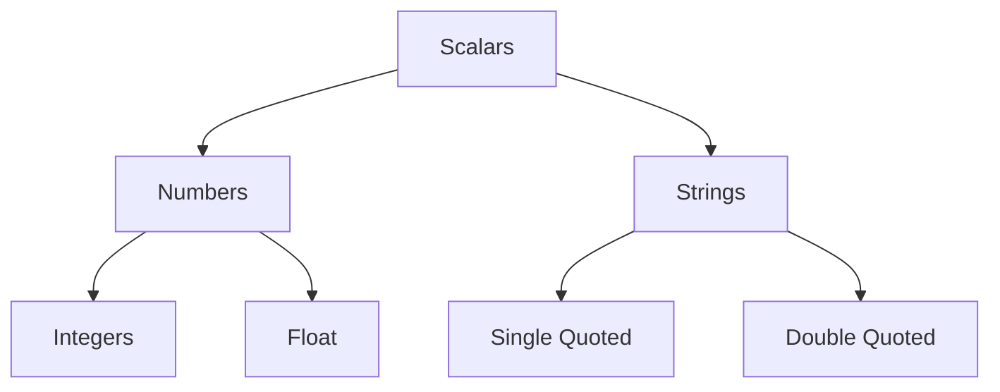

## Perl Data Types
- Perl language is a `loosely typed` language,
- The perl `interpreter` itself chooses the data types. Hence, there is no need to specify data type in Perl.
- There are `3 data types` in PERL.
    - `Scalars`: Perl Scalars are a single data item. They are simple variables, preceded by a ($) sign. A scalar can be a number, a reference (adress of a variable) or a string.
    - `Arrays`: Perl arays are an ordered list of scalars. They aer preceded by (@) sign and accessed by their index numbers which starts with 0.
    - `Hashes`: Perl hashes are an unordered collection of key-value pairs. They are preceded by (%) sign and accessed using keys.
## Perl Scalars



## Perl Literals
- `Notice`: In general, `Perl interpreter sees integers like floating points numbers. For example, if you write 2 in your programs, Perl will see it like 2.0000`
- Perl numeric literals are numbers. Perl stores number internally as either signed integers or floating-point values.
- Perl numeric literals can be assigned following types of formats.

| Number | Type |
| - | - |
| 526 | Integer |
| 5.5 | Floating-Point |
| 5e10 | Scientific Notation |
| 5.5E | Scientific Notation |
| 5_549_63 | A large Number |
| 010101 | Binary |
| 0175 | Octal |
| AF0230 | Hexadecimal |

- Combination of 0 and 1 represents a `binary` number with base 2.
- Number with a leading 0 comes in the category of `octal` numbers with base 8.
- Number containing alphabets (a, b, c, d, e, f) are `hexadecimal` numbers with base 16.

| Representation | Base | Proceed by |
| - | - | - |
| Octal | 8 | 0 (zero) |
| Hexadecimal | 16 | 0x |
| Binary | 2 | 0b |
Perl Example:
```perl
255;                               # 255 in decimal notation
0377;                                   # 255 in octal notation
0xff;                                   # 255 in hexadecimal notation
0b11111111;                             # 255 in binary notation
```

## Perl String Literals
- The maximum length of a string in Perl depends upon the amount of memory the computer has
- Perl string literals contain an empty string. ASCII test, ACII with high bits or binary data. There is `no limit` in a string to contain data. They are surrounded by either a single quote (') or double quote (").
- `Variable interpolation` is allowed in `double quote` string but not in single quote string. Also `special characters preceding with backslash` (\) are supported by `double quote` strings only.

## Single-quoted string literals
- Single quotation marks are used to enclose data you want to be taken literally. A short example and everything should be clear:
- Perl Examples:
```perl
#!/usr/bin/perl
$num = 7;
$txt = 'it is $num';
print $txt;
```
output:
```perl
it is $num
```
- Here due to single quotes value of $num in not taken and the literal characters ‘$’,’n’, ‘u’ & ‘m’ are added to the value of $txt

## Double-quoted string literals
- Double quotation marks are used to enclose data that needs to be interpolated before processing.
- That means that escaped characters and variables aren’t simply literally inserted into later operations, but are evaluated on the spot.
- Escape characters can be used to insert newlines, tabs, etc.
```perl
$num = 7;
$txt = "it is $num";
print $txt;
```
Output:
```perl
it is 7
```
- Here due to double quotes value of $num is taken added to the value of $txt
- Double-quotes interpolate scalar and array variables, but not hashes. On the other hand, you can use double-quotes to interpolate slices of both arrays and hashes.


## Perl variables
- There are three types of variables:
    - Scalar defined $
    - Arrays defined by @
    - Hashes defined by %
- The same variable can be used for all these three types of variabels in a program. For example, $name, @name, and %name, all three variables will be considered different in a program.

## Perl variables declarations
- Here we have created three variables $name, $rank and $marks.
```perl
    $name = "Anastasia";
    $rank = "9th";
    $marks = 756.5;
```
## Perl use strct
- If you are using use `strict` statement in a program, then you have to `declare your variable before using` it. It is `mandatory`. Otherwise you'll get an error.
- the `$a` and `$b` are `special variables` used in perl `sort` function. There is no need to declare these two variables. So it is recommend not to use these two variable except in connection to sort.
- Variables can be declared using `my`, `our`, `use vars`, `state` and `$person::name` (explicit package name). Although, they all have different meanings.
```perl
    use 5.010;
    use strict;
    my $x = 23;
    say $x;
    state $name = "Anastasia";
    say $name;
    our $rank = "9th";
    say $rank;
    use vars qw($marks);
    $marks = 756.5;
    say $marks;
    $Person::name = 'John';
    say $Person::name;
    $a = 1224365;
    say $a;
    $b = "Welcome at JavaTpoint";
    say $b;
```
output:
```perl
23
Anastasia
9th
756.5
John
1224365
Welcome at JavaTpoint
```

## Perl Scalars
- A scalar contains a single unit of data. It is preceded with a ($) sign followed by letters, numbers and underscores.
- A scalar can contain anything a number, floating point number, a character or a string.
- We can define scalars in two ways.
    - First, we can declare and assign value together.
    - Second, we will first declare and then assign value to the scalar.
- In the following example, we'll show both the methods to defince scalars.
```perl
use strict;
use warnings;
use 5.010;
#Declairing and assigning value together
my $color = "Red";
say $color;
#Declairing the variable first and then assigning value
my $city;
$city = "Delhi";
say $city;
```
Output:
```perl
Red
Delhi
```

## Perl scalar operations
- In this example we'll perform different operations with two scalar variables $x and $y. In perl, operator tells operand how to behave.

Example:
```perl
use strict;
use warnings;
use 5.010;
my $x = 5;
say $x;
my $y = 3;
say $y;
say $x + $y;
say $x - $y;
say $x * $y;
say $x . $y;
say $x x $y;
```
```perl
3
8
2
15
1.66666666666667
53
555
```

## Perl Special Literals
- There are three special literals in Perl:
- `__FILE__`: it represents the `current file name`.
- `__LINE__`: it represents the `current line number`.
- `__PACKAGE__`: it represents the `package name at that point` in your program.
```perl
use strict;
use warnings;
use 5.010;
#!/usr/bin/perl
print "File name ". __FILE__ . "\n";
print "Line Number " . __LINE__ ."\n";
print "Package " . __PACKAGE__ ."\n";
# they can't be interpolated
print "__FILE__ __LINE__ __PACKAGE__\n";
```
output:
```perl
File name .\hello.pl
Line Number 28
Package main
__FILE__ __LINE__ __PACKAGE__
```

## Perl string context
- Perl automatically converts `strings to numbers` and `numbers to strings` as per the requirement.
- For example,
    - 5 is same as "5".
    - 5.123 is same as "5.123"
- But if a string has some characters other than numbers, how would they behave in the arithmetic operations. Let's see it throught an  example.
```perl
use strict;
use warnings;
use 5.010;
my $x = "5";
my $y = "2cm";
say $x + $y;
say $x . $y;
say $x x $y;
```

output:
```perl
# Argument "2cm" isn't numeric in addition (+) at .\hello.pl line 36, <> line 1.
7
52cm
55
```

- In numerical context, Perl looks at the left side of the string, and convert it to the number.
- The character becomes the numerical value of the variable.
- In numerical context (+) the given string "2cm" is regarded as the number 2.
- Although, it generates warning as
    `Argument "2cm" isn't numeric in addition (+) at hw.pl line 9.  `
- What has happened here is, Perl does not convert `$y` into a numerical value. `It just used its numerical part i.e; 2`.

## Perl undef
- If you'll not define anything in the variable, it is considered as undef. In numerical context, it acts as 0. In string contect, it acts as empty string.


```perl
use strict;
use warnings;
use 5.010;
my $x = "5";
my $y;
say $x + $y;
say $x . $y;
say $x x $y;
if (defined $y) {
  say "defined";
} else {
  say "NOT";
}
```
output:
```perl
Use of uninitialized value $y in addition (+) at .\hello.pl line 44, <> line 1.
5
Use of uninitialized value $y in concatenation (.) or string at .\hello.pl line 45, <> line 1.
5
Use of uninitialized value $y in repeat (x) at .\hello.pl line 46, <> line 1.

NOT
```

## PERL Operators
- A perl operator is a series of symbols used as syntax. An operator is a sort of function and its operands are arguments.
## Perl operator precedence
- Perl precedence acts like BODMAS in Mathematics. Addition adn Subtraction always comes after the Multiplication ad Division.
- For example:
```math
8 + 4 - 5 * 6 / 3 = 2 \\
8 + 4 - 5 * 2 = 2 \\
8 + 4 - 10 = 2 \\
```
```perl
use 5.010;
use strict;
use warnings;
my $result1 = 8 + 4 - 5 * 6 / 3 ;
say $result1;
my $result2 = 12 * 3 + 2 ** 2 << 1;
say $result2;
```
output:
```perl
2
80
```

## Perl Operator Associativity
- The associativity of an operator helps you to decide whether to ecaluate an equation from `(left to right)` or `(right to left)`.
- The order of operations is very improtant. Sometimes it is same from both the sides but sometimes it produces drastic difference.
- For example:
```math
3 ** 2 ** 3
```

    - The answer for this will be `(9**3)` from left to right and
    - `(3**8)` from right to left
    - Both the answers have a lot of difference.
- For example:
```perl
use 5.010;
use strict;
use warnings;
my $result = 3 ** 2 ** 3;    # works right to left:  3 ** 8 => 6561
say $result;
```
output:
```perl
6561
```

## Perl Arity
- The arity of an operator can be defines as the number of operands on which it operates.
- A `nullary` operator operates on Zero operand,
- A `unary` operator operates on one operand.
- A `binary` operator operates on two operands
- A `listary` operator operates on list of operands.
- For example:
```math
3 + 3 ? 2
```
- Arithmetic operators are usually left associative. Here, (3+3) evaluates first and then goes to the second (:) operator.
- For example
```perl
use 5.010;
use strict;
use warnings;
my $result = ( 5 - 2 + 10 ) * 2;
say $result;
```
output:
```perl
26
```

## Perl Fixity
- Operator Fixity can be defined as its position relative to its operands.
- For example:
    - Infix Operator appears between its operands.
